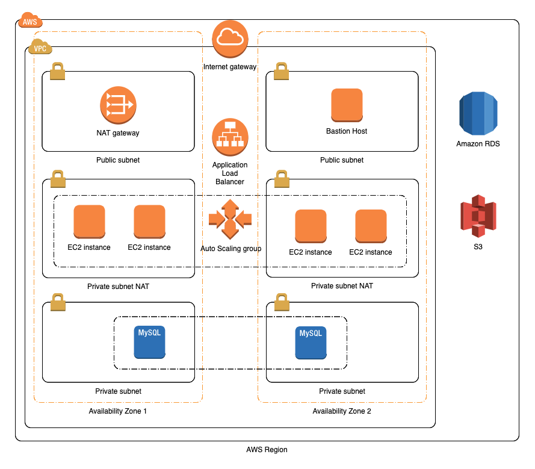

# Infrastructure as Code

코드형 인프라 또는 인프라 코드화는 이름 자체에서 설명하듯이 인프라를 코드를 통해서 구성 및 설정하는 방법론입니다. 인프라를 일종의 소프트웨어라고 생각하고 기계가 읽을 수 언어를 (프로그래밍 언어 또는 코드) 사용해서 개발하는 Pracitce 입니다.

## CloudFormation 101

### CloudFormation Stack 생성

1. AWS Management Console 좌측 상단에 있는 **[Services]** 를 선택하고 검색창에서 CloudFormation을 검색하거나 Management & Governance 밑에 있는 **[CloudFormation]** 를 선택

2. CloudFormation을 Dashboard에서 **[Create stack]** 클릭후,\
**Prepare template** = Template is ready,\
**Template source** = Upload a template file,\
**Choose file** = ec2.yml,\
**[Next]** 클릭

3. **Stack name** = cfn-ec2,\
**EC2 Instance Name** = test,\
**Instance Type** = t2.micro,\
**AMI Id** = ami-0d59ddf55cdda6e21,\
**EC2 Key Pair Name** = EC2 인스턴스에 부여할 키페어 지정,\
**VPC** = EC2 인스턴스를 생성할 VPC 지정,\
**Subnet** = EC2 인스턴스를 생성할 Subnet 지정,\
**Elastic IP** = Elastic IP 부여 여부 선택,\
**[Next]** 클릭

4. **[Next]** &rightarrow; :white_check_mark: I acknowledge that AWS CloudFormation might create IAM resources. &rightarrow; **[Create Stack]**

### CloudFormation Stack Update

1. 텍스트 에디터에서 ec2.yml 파일을 열고 Instance 블록을 아래와 같이 수정

    ```yaml
    Instance:
      Type: AWS::EC2::Instance
      Properties:
        ImageId: !Ref AMIId
        InstanceType: !Ref EC2InstanceType
        DisableApiTermination: false
        InstanceInitiatedShutdownBehavior: stop
        Monitoring: false
        KeyName: !Ref KeyName
        SecurityGroupIds:
          - !Ref InstanceSecurityGroup
        SubnetId: !Ref Subnet
        Tags:
          -
            Key: Name
            Value: !Ref EC2Name
        UserData:
          Fn::Base64:
            !Sub |
                #!/bin/bash -xe
                sudo yum install -y httpd
                echo "<html>Hello-World!!</html>" > /tmp/index.html
                sudo cp /tmp/index.html /var/www/html/index.html
                sudo chmod 755 /var/www/html/index.html
                sudo service httpd start
                sudo chkconfig httpd on
      DependsOn:
        - InstanceSecurityGroup
    ```

2. 텍스트 에디터에서 ec2.yml 파일을 열고 아래 블록을 추가

    ```yaml
    HTTPIngressRule:
      Type: AWS::EC2::SecurityGroupIngress
      Properties:
        GroupId: !Ref InstanceSecurityGroup
        IpProtocol: tcp
        FromPort: 80
        ToPort: 80
        CidrIp: 0.0.0.0/0
      DependsOn:
        - InstanceSecurityGroup
    ```

3. CloudFormation Dashboard에서 위에서 생성한 스택을 선택 후 **[Update]** 클릭 &rightarrow; \
**Prepare template** = Replace current template,\
**Template source** = Upload a template file,\
**Choose file** = ec2.yml,\
**[Next]** 클릭

4. 기존에 입력한 Parameters를 변경하지 말고 **[Next]** 클릭 &rightarrow; **[Next]** &rightarrow; :white_check_mark: I acknowledge that AWS CloudFormation might create IAM resources. &rightarrow; **[Update Stack]**

5. 새롭게 추가된 Userdata가 적용 되었는지 확인, 안되었다면 무엇이 때문인지 확인

6. 위에서 생성한 CloudFormation 스택을 삭제하고 ec2-lt.yml을 이용해서 스택 생성

7. Step 1 & 2에 명시된 보안그룹 인바운드 룰 및 Userdata script를 ec2-lt.yml에 적용 후 스택 업데이트.

8. Userdata 내용이 적용 되었는지 확인, Step 5와의 차이점 비교

### Mapping

1. CloudFormation을 Dashboard에서 **[Create stack]** 클릭후,\
**Prepare template** = Template is ready,\
**Template source** = Upload a template file,\
**Choose file** = ec2-mapping.yml,\
**[Next]** 클릭

2. **Stack name** = cfn-ec2,\
**EC2 Instance Name** = test,\
**Environment** = test,\
**AMI Id** = ami-0d59ddf55cdda6e21,\
**EC2 Key Pair Name** = EC2 인스턴스에 부여할 키페어 지정,\
**VPC** = EC2 인스턴스를 생성할 VPC 지정,\
**Subnet** = EC2 인스턴스를 생성할 Subnet 지정,\
**Elastic IP** = Elastic IP 부여 여부 선택,\
**[Next]** 클릭

3. **[Next]** &rightarrow; :white_check_mark: I acknowledge that AWS CloudFormation might create IAM resources. &rightarrow; **[Create Stack]**

4. 인스턴스 타입 확인

5. CloudFormation Dashboard에서 위에서 생성한 스택을 선택 후 **[Update]** 클릭 &rightarrow; \
**Prepare template** = Use current template,\
**[Next]** 클릭

6. **Environment** = prod 으로 변경 후 **[Next]** 클릭 &rightarrow; **[Next]** &rightarrow; :white_check_mark: I acknowledge that AWS CloudFormation might create IAM resources. &rightarrow; **[Update Stack]**

7. 인스턴스 타입 확인

### Cross-stack reference

1. CloudFormation을 Dashboard에서 **[Create stack]** 클릭후,\
**Prepare template** = Template is ready,\
**Template source** = Upload a template file,\
**Choose file** = vpc-cross.yml,\
**[Next]** 클릭

2. **Stack name** = vpc-cross, **[Next]** 클릭 &rightarrow; **[Next]** &rightarrow; **[Create Stack]**

3. CloudFormation을 Dashboard에서 **[Create stack]** 클릭후,\
**Prepare template** = Template is ready,\
**Template source** = Upload a template file,\
**Choose file** = ec2-cross.yml,\
**[Next]** 클릭

4. **Stack name** = ec2-cross,\
**EC2 Instance Name** = test,\
**Instance Type** = t2.micro,\
**AMI Id** = ami-0d59ddf55cdda6e21,\
**EC2 Key Pair Name** = EC2 인스턴스에 부여할 키페어 지정,\
**Elastic IP** = Elastic IP 부여 여부 선택,\
**NetworkStackName** = vpc-cross,\
**[Next]** 클릭

5. **[Next]** &rightarrow; :white_check_mark: I acknowledge that AWS CloudFormation might create IAM resources. &rightarrow; **[Create Stack]**

## Nested Stack 으로 2-tier 아키텍쳐 배포

### Architecture Overview



1. AWS Management Console에서 좌측 상단에 있는 **[Services]** 를 선택하고 검색창에서 S3를 검색하거나 **[Storage]** 바로 밑에 있는 **[S3]** 를 선택

2. S3 Dashboard에서  **[Create bucket]** 클릭후, **Bucket name** = aws-cfn-lab-[임의의 문자 및 숫자], **Region** = Asia Pacific (Seoul), **[Create]** 클릭

3. 위에서 만든 S3 버킷에 nested-stack 폴더안에 있는 템플릿들을 복사

4. CloudFormation을 Dashboard에서 **[Create stack]** 클릭후,\
**Prepare template** = Template is ready,\
**Template source** = Amazon S3 URL,\
**Amazon S3 URL** = https://<BUCKET_NAME>.s3.ap-northeast-2.amazonaws.com/sample-app.yml,\
**[Next]** 클릭

5. **Stack name** = two-tier,\
**Name of Project** = cfn,\
**Environment** = test,\
**NetworkTemplateS3URL** = https://<BUCKET_NAME>.s3.ap-northeast-2.amazonaws.com/vpc.yml,\
**Dedicated NAT gateways** = false,\
**EC2TemplateS3URL** = https://<BUCKET_NAME>.s3.ap-northeast-2.amazonaws.com/ec2.yml,\
**Instance Type** = t2.micro,\
**AMI Id** = ami-0d59ddf55cdda6e21,\
**EC2 Key Pair Name** = EC2 인스턴스에 부여할 키페어 지정,\
**Elastic IP** = Elastic IP 부여 여부 선택,\
**RDSTemplateS3URL** = https://<BUCKET_NAME>.s3.ap-northeast-2.amazonaws.com/rds.yml,\
**RDS instance type** = db.t2.micro,\
**RDS instance storage size** = 20,\
**RDS instance engine** = mysql,\
**RDS instance engine version** = 8.0.16,\
**RDS database master password** = 원하는 비밀번호 입력,\
**RDS Multi-AZ deployment** = false,\
**RDS deletion protection** = false,\
**RDS backup retention period** = 1,\
**LaunchTemplateS3URL** = https://<BUCKET_NAME>.s3.ap-northeast-2.amazonaws.com/lt.yml,\
**Instance Type** = t2.micro,\
**AMI Id** = ami-0d59ddf55cdda6e21,\
**ASGTemplateS3URL** = https://<BUCKET_NAME>.s3.ap-northeast-2.amazonaws.com/asg.yml,\
**ALBTemplateS3URL** = https://<BUCKET_NAME>.s3.ap-northeast-2.amazonaws.com/alb.yml,\
**SSL Certificate** = SSL Certificate ARN 입력,\
**[Next]** 클릭

6. **[Next]** &rightarrow; :white_check_mark: I acknowledge that AWS CloudFormation might create IAM resources with custom names,\
:white_check_mark: I acknowledge that AWS CloudFormation might require the following capability: CAPABILITY_AUTO_EXPAND &rightarrow; **[Create Stack]**

7. **[Outputs]**을 탭에서 ALBALBEndpoint을 찾고 해당 URL로 접속 가능한지 확인

### 배포 파이프라인 구축
  - CloudFormation 템플릿들을 Github에 호스팅
  - AWS CodePipeline을 이용해서 코드 변경시 배포 자동화 구성

1. 해당 [Git Repository](https://github.com/woowhoo/react-ecommerce)를 Fork (GitHub 계정 필수)

2. AWS Management Console에서 좌측 상단에 있는 **[Services]** 를 선택하고 검색창에서 IAM를 검색하거나 **[Security, Identity, & Compliance]** 바로 밑에 있는 **[IAM]** 를 선택

3. IAM Dashboard에서  **[Roles]** 클릭후, **[Create role]** 클릭

4. **Choose the service that will use this role**에 CloudFormation를 선택 &rightarrow; **[Next: Permissions]** &rightarrow; :white_check_mark: AdministratorAccess &rightarrow; **[Next: Tags]** &rightarrow; **[Next: Review]**

5. **Role name** = cfnlab-codepipeline, **[Create Role]** 클릭

6. AWS Management Console에서 좌측 상단에 있는 **[Services]** 를 선택하고 검색창에서 CodePipeline를 검색하거나 **[Developer Tools]** 밑에 있는 **[CodePipeline]** 를 선택

7. **[Create pipeline]** &rightarrow; **Pipeline name** = iac, **Service role** = New service role &rightarrow; **[Next]** &rightarrow; **Source provider** = GitHub &rightarrow; **[Connect to GitHub]** &rightarrow; **Repository** = Step 1에서 Forking한 Repository, **Branch** = master &rightarrow; **[Next]** &rightarrow; **Build provider** = AWS CodeBuild &rightarrow; **[Create project]**

8. **Project name** = iac, **Environment image** = Managed Image, **Operating system** = Amazon Linux 2, **Runtime(s)** = Standard, **Image** = aws/codebuild/amazonlinux2-x86_64-standard:2.0, **Service role** = New service role, **Build specifications** = Insert build commands &rightarrow; **[Switch to editor]** &rightarrow; 아래 커맨드블록을 Build commands에 붙여놓고 **[Continue to CodePipeline]**

   ```yaml
   version: 0.2

   phases:
     install:
       runtime-versions:
         python: 3.8
     build:
       commands:
         - for f in nested-stack/*.yml; do aws cloudformation validate-template --template-body file://$f; done
         - aws s3 sync nested-stack s3://<BUCKET_NAME>
   artifacts:
     files:
       - nested-stack/sample-app.yml
       - nested-stack/config.json
     discard-paths: yes
   ```

9. **[Next]** &rightarrow; **Deploy provider** = AWS CloudFormation, **Action mode** = Create or update a stack, **Stack name** = two-tier, **Artifact name** = BuildArtifact, **File name** = sample-app.yml, :white_check_mark: Use configuration file, **Artifact name** = BuildArtifact, **File name** = config.json, **Capabilities** = 모두 선택, Role name = cfnlab-codepipeline &rightarrow; **[Next]** &rightarrow; **[Create pipeline]**
